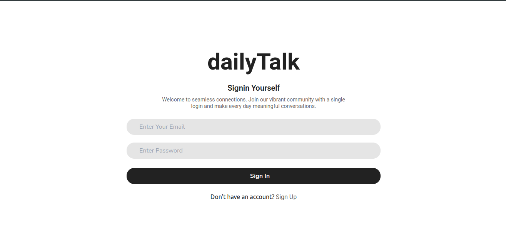

# DailyTalk

## A chat application based on ReactJS and Firebase


<p style="text-align:center;">DailyTalk is a project aimed at facilitating daily communication and interaction among users through a web-based platform. Whether it's for team collaboration, informal discussions, or sharing updates, DailyTalk provides a convenient space for users to engage in conversation  share multimedia content and stay connected.</p>



## Installation

1. Clone the repository

```bash
git clone https://github.com/km-saifullah/dailytalk.git
```

2. Navigate to the project directory

```bash
cd dailytalk
```

3. Create env file in your project root directory

```bash
touch .env
```

4. Copy all the text from the <b>.env.sample</b> file and paste to the <b>.env</b> file. Then you need to fill up the strings according to your Firebase Credential Information

```bash
VITE_FIREBASE_API_KEY ="Your Firebase API Key"
VITE_FIREBASE_AUTH_DOMAIN = "Your Firebase Auth Domain"
VITE_FIREBASE_PROJECT_ID = "Your Firebase Project ID"
VITE_FIREBASE_STORAGE_ID = "Your Firebase Bucket ID"
VITE_FIREBASE_MESSAGING_SENDER_ID = "Your Firebase Messaging Sender ID"
VITE_FIREBASE_APP_ID = "Your Firebase App ID"
```

5. Install dependencies

```bash
npm install
```

6. Run the application

```bash
npm run dev
```

## Technology Used

- React.js
- Tailwind CSS
- Firebase

## Features

- User Authentication
- Send Friend Request
- Accept Friend Request
- Delete Friend Request
- User Block Functionality
- Unblock Functionality
- User Verfication Email
- Send Individual Message
- Receive Individual Message
